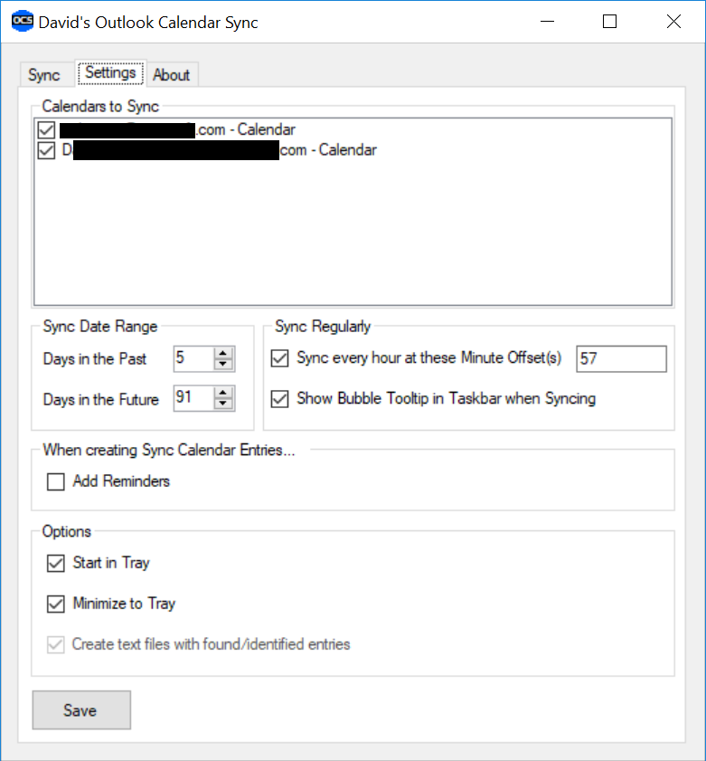

# OutlookCalendarSync

A simple utility to create synced calendar items between multiple Outlook calendars. If you maintain more than one personal Calendar for multiple orgs, this can help you keep your free/busy time correct for people in each org.

This was forked from my Outlook Google Calendar Sync utility for which the original source came from a codeplex project by Zissis Siantidis many years ago and I have modified and extended it to suit my needs.

# Instructions

## Install

Download the [latest release](https://github.com/David-Engel/OutlookCalendarSync/releases/latest) and run the installer. It will create a Start Menu shortcut and one in your personal Startup folder so it will start on login. It requires Outlook to be installed locally (only tested against Outlook 2016).

## Configure Settings

Settings are hopefully mostly self-explanatory:

**Calendars to Sync**

Check (double-click) all the calendars you want to sync (at least two).

**Sync Date Range**

Set the range of days you want to gather appointments in each calendar to sync. If you want it to sync regularly, check the box and set the desired minute(s) of each hour you want it to run. Multiple minutes can be defined by using a comma separator.

**Save**

Settings changes take effect immediately in the current session. To preserve Settings the next time the application is run, use the Save button to write settings to Settings.xml in the same folder as the EXE. Those settings will be loaded the next time the application is run.

## Sync

Switch to the Sync tab and push the Sync button

For each calendar checked, all appointment items will be read within the sync date range specified and for every other calendar checked, a copy of the appointment item will be created with most details preserved. The organizer will be you on copies. Reminders will only be copied if you ckecked the Add Reminders option, otherwise they will be set to None (I don't need double reminders). The Subject will be prefixed with (c) to make it easy to identify the original appointment from copies when looking at your calendars in Outlook.

If you want to clean everything up, the Delete All Sync Items button will delete any Appointment Items created by the application in all selected calendars (Settings) within the specified Sync Date Range (Settings).
